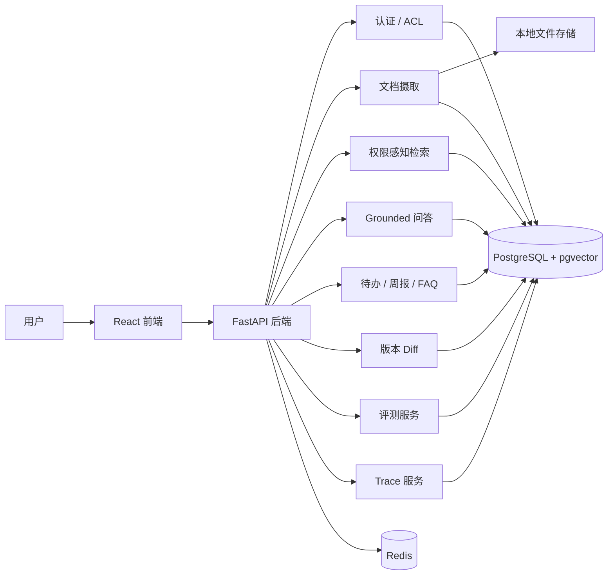

# 权限感知的 RAG 企业文档知识助手

面向企业知识库的权限感知 RAG 应用，支持多角色访问控制、引用溯源、版本对比与结构化工作流生成。

## 界面预览
<p align="center">
  
</p>
<p align="center">
  <sub>主流程示意：权限感知检索、引用问答与会话沉淀</sub>
</p>

## 项目概述
这个项目聚焦企业文档知识场景，目标不是做一个只会聊天的演示页，而是把权限控制、文档检索、引用溯源、版本追踪和结构化结果沉淀放进一条完整链路里。

它解决的核心问题是：
- 用户只能检索和引用自己有权限访问的文档
- 回答要尽量带 citation，而不是只给一段自由文本
- 会话不止用于问答，还能继续沉淀为待办、周报草稿和 FAQ 草稿
- 文档版本变更可以被对比、总结和解释
- 整个链路可以被评测和追踪，而不是只能手工演示

## 项目说明
这是一个面向企业知识库的权限感知 RAG 文档知识助手，主要包括以下功能：
- 权限感知检索：无权限文档不会进入候选集
- Grounded QA：回答与引用来源分开返回
- 版本对比：支持原始 diff、差异摘要和影响提示
- 结构化工作流：支持待办、周报草稿、FAQ 草稿生成
- Eval 与 Observability：支持效果验证与链路追踪

## 主要功能
- mock 登录与本地账号：`viewer / manager / admin`
- 支持 `TXT / Markdown / HTML / PDF / DOCX` 文档上传与摄取
- 文档版本管理与历史保留
- 文档级 ACL：支持 `public / user / role / team`
- 基于 PostgreSQL FTS + pgvector 的权限感知混合检索
- grounded QA：回答、citation、confidence、证据不足兜底
- 派生工作流：
  - 待办提取
  - 周报草稿生成
  - FAQ 草稿沉淀
- 文档 diff：原始 unified diff、变更摘要、潜在影响提示
- Eval：
  - retrieval hit rate
  - citation accuracy
  - answer faithfulness
  - permission isolation correctness
- Observability：记录 trace、召回 chunk、selected citation、延迟、token、错误
- 最小但完整的 React 前端演示链路

## 项目特点
- 权限控制直接纳入检索流程，而不是在结果展示阶段再做过滤
- 问答结果单独返回 citation，便于追溯答案来源
- 除了问答，还支持待办、周报草稿和 FAQ 草稿生成
- 支持文档版本对比与差异摘要，便于跟踪文档变化
- 提供基础测试与链路记录，方便验证效果和定位问题

## 系统架构


## 仓库结构
```text
/backend
  /alembic
  /app
    /api
    /core
    /db
    /models
    /repositories
    /schemas
    /services
    /tests
    /workers
/frontend
  /src
/docs
/scripts
docker-compose.yml
```

## 技术栈
- 后端：Python 3.11、FastAPI、Pydantic v2、SQLAlchemy 2.x、Alembic
- 数据库：PostgreSQL、pgvector
- 缓存：Redis
- 前端：React、Vite、TypeScript、React Router
- LLM 集成：OpenAI SDK + OpenAI-compatible provider + deterministic fallback
- 测试：pytest
- 本地运行与集成：Docker Compose

## 已实现模块
- 认证与 mock 用户初始化
- 角色、文档 ACL、权限判断
- 文档上传、解析、切块、向量化、索引
- 权限感知混合检索
- citation grounding 问答与会话历史
- 待办提取 / 周报草稿 / FAQ 草稿
- 文档版本上传、版本对比与摘要
- Eval 服务与 demo case
- Observability trace 与简单 dashboard API
- 最小前端整合页面

## 当前未实现
- 企业级 SSO / LDAP / OAuth 接入
- 多租户与复杂组织架构
- 生产级异步任务队列
- 扫描版 PDF 的深度 OCR 优化
- Slack / 飞书 / 邮件等外部协作集成
- cross-encoder rerank 或更高级 judge 评测
- 完整的生产部署与安全加固

## 运行与验证
- 支持通过 `docker compose up --build` 启动完整本地环境
- 提供 `seed_demo_data.py` 用于初始化演示知识库数据
- 仓库包含 chat、search、ACL、version、workflow、observability 等后端测试用例
- 已覆盖 admin、manager、viewer 三类角色的权限隔离演示场景

## Eval Results

### 回归修复集（`demo_permission_eval`，3 cases）

| 指标 | 修复前 | 修复后 |
|------|--------|--------|
| retrieval_hit_rate_avg | 0.667 | 1.0 |
| citation_accuracy_avg | 0.667 | 1.0 |
| answer_faithfulness_avg | 0.60 | 0.933 |
| permission_isolation_pass_rate | 0.667 | 1.0 |

发现 `viewer` 账号因 `team_name` 配置与评测用例预期不一致，导致权限隔离 case 失败；定位后修复了 bootstrap 默认用户同步逻辑并补充回归测试，修复后 `demo_permission_eval` 全部 case 通过。

### 扩展权限矩阵集（`demo_access_matrix_eval`，8 cases）

| 指标 | 当前结果 |
|------|----------|
| pass_count | 8 / 8 |
| retrieval_hit_rate_avg | 1.0 |
| citation_accuracy_avg | 1.0 |
| answer_faithfulness_avg | 0.95 |
| permission_isolation_pass_rate | 1.0 |

这组扩展评测覆盖普通员工、组长、管理员三类账号，以及公开文档、团队文档、角色文档和管理员专属文档等权限场景，主要验证不同角色下的可访问、不可访问和拒答行为。


## 本地启动
### Docker Compose
在仓库根目录执行：

```powershell
docker compose up --build
```

启动后默认服务：
- PostgreSQL + pgvector：`localhost:5432`
- Redis：`localhost:6379`
- FastAPI 后端：`http://localhost:8500`
- React 前端：`http://localhost:5173`

### 初始化演示数据
容器启动后执行：

```powershell
docker compose exec backend python /app/scripts/seed_demo_data.py
```

会初始化一组适合演示的中文知识库数据，包括：
- `员工手册`
- `平台发布手册`
- `客户事故响应指南`
- `安全例外登记`

### 不使用 Docker 的本地开发方式
后端：

```powershell
cd backend
python -m venv .venv
.\.venv\Scripts\Activate.ps1
Copy-Item .env.example .env
pip install -e .
alembic upgrade head
uvicorn app.main:app --reload
```

前端：

```powershell
cd frontend
npm install
npm run dev
```

## 演示账号
当后端环境变量 `SEED_MOCK_DATA=true` 时，系统启动会自动创建以下账号：
- `viewer@local.test / viewer123`
- `manager@local.test / manager123`
- `admin@local.test / admin123`

## 演示流程
1. 执行 `docker compose up --build`
2. 执行 `docker compose exec backend python /app/scripts/seed_demo_data.py`
3. 打开 `http://localhost:5173`
4. 使用 `admin@local.test` 登录
5. 在 `Documents` 页面查看文档、版本、ACL 和 chunk
6. 在 `Chat` 页面提问并查看 citation
7. 从当前 session 生成待办、周报草稿和 FAQ 草稿
8. 在 `Versions` 页面查看文档 diff 和摘要
9. 在 `Insights` 页面运行 demo eval 并查看 trace
10. 切换 `viewer` 或 `manager` 验证权限隔离效果

## 关键接口
### 认证
- `POST /api/v1/auth/login`
- `GET /api/v1/auth/me`

### 文档与权限
- `POST /api/v1/documents/upload`
- `GET /api/v1/documents`
- `GET /api/v1/documents/{id}`
- `POST /api/v1/documents/{id}/versions/upload`
- `GET /api/v1/documents/{id}/versions`
- `GET /api/v1/documents/{id}/versions/{version_id}`
- `POST /api/v1/documents/{id}/acl`
- `GET /api/v1/documents/{id}/acl`
- `POST /api/v1/documents/{id}/ingest`
- `GET /api/v1/documents/{id}/chunks`

### 检索与问答
- `POST /api/v1/search`
- `POST /api/v1/chat/sessions`
- `GET /api/v1/chat/sessions`
- `GET /api/v1/chat/sessions/{id}`
- `POST /api/v1/chat/sessions/{id}/messages`

### 任务流转
- `POST /api/v1/tasks/extract`
- `GET /api/v1/tasks`
- `POST /api/v1/reports/weekly`
- `GET /api/v1/reports`
- `POST /api/v1/faqs/generate`
- `GET /api/v1/faqs`

### 版本差异
- `GET /api/v1/documents/{id}/diff?from_version=&to_version=`
- `POST /api/v1/documents/{id}/diff/summary`

### Eval 与 Observability
- `POST /api/v1/eval/run`
- `GET /api/v1/eval/runs`
- `GET /api/v1/eval/runs/{id}`
- `GET /api/v1/observability/traces`
- `GET /api/v1/observability/traces/{id}`

## 环境变量说明
- Docker Compose 下前端通过 Vite 代理 `/api` 到容器内的 `http://backend:8000`
- 宿主机访问后端地址为 `http://localhost:8500`
- 默认使用 deterministic embedding / answer provider，因此不依赖外部模型也可以本地演示
- `JWT_SECRET_KEY` 建议使用至少 32 字节以上的随机字符串；仓库中的示例值仅用于本地开发与演示

### OpenAI-compatible provider
当前后端配置同时支持 DeepSeek 等 OpenAI-compatible 聊天模型服务，以及通过 `OPENAI_BASE_URL` 映射到 OpenRouter 的 embedding 服务。当前项目推荐使用“DeepSeek 负责 chat，OpenRouter 负责 embedding”的组合：

```env
EMBEDDING_PROVIDER=openai
ANSWER_PROVIDER=openai_compatible
ROUTER_PROVIDER=openai_compatible
DIFF_SUMMARY_PROVIDER=openai_compatible

LLM_API_KEY=your_deepseek_api_key
LLM_BASE_URL=https://api.deepseek.com
LLM_CHAT_MODEL=deepseek-chat
LLM_ROUTER_MODEL=deepseek-chat
LLM_REASONING_MODEL=deepseek-reasoner

OPENAI_API_KEY=your_openrouter_api_key
OPENAI_BASE_URL=https://openrouter.ai/api/v1
OPENAI_EMBEDDING_MODEL=openai/text-embedding-3-small
OPENAI_CHAT_MODEL=gpt-4.1-mini
OPENAI_ROUTER_MODEL=gpt-4.1-mini
OPENAI_DIFF_MODEL=gpt-4.1-mini

JWT_SECRET_KEY=replace-with-a-long-random-secret
```

配置说明：
- `LLM_BASE_URL` 用于接入 DeepSeek 等 OpenAI-compatible 聊天模型服务
- `LLM_CHAT_MODEL / LLM_ROUTER_MODEL / LLM_REASONING_MODEL` 对应问答、路由与推理模型配置
- `OPENAI_BASE_URL` 可用于把 embedding 请求映射到 OpenRouter 等兼容 OpenAI embeddings 的服务
- `OPENAI_API_KEY` 在这套组合里应填写 OpenRouter key，而不是 OpenAI 官方 key
- 当前代码已验证可以实例化 `OpenAIEmbeddingProvider`，并向 `https://openrouter.ai/api/v1/embeddings` 发起实际请求
- 若 embedding 请求失败，系统会自动回退到 deterministic embedding 以保证本地演示不中断

## 文档说明
- RAG 技术链路：[`docs/RAG_NOTES.md`](docs/RAG_NOTES.md)
- 项目说明：[`docs/PROJECT_OVERVIEW.md`](docs/PROJECT_OVERVIEW.md)
- 手动上传演示样例：[`docs/manual_upload_demo.md`](docs/manual_upload_demo.md)
- 手动上传演示样例 v2：[`docs/manual_upload_demo_v2.md`](docs/manual_upload_demo_v2.md)


