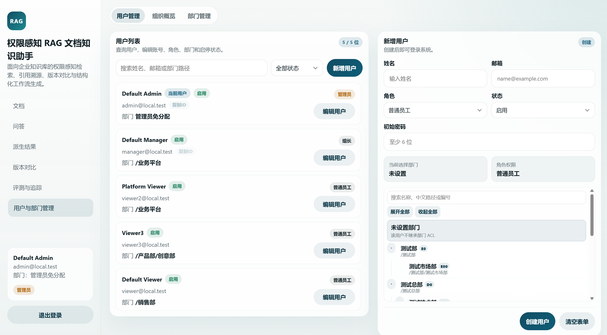
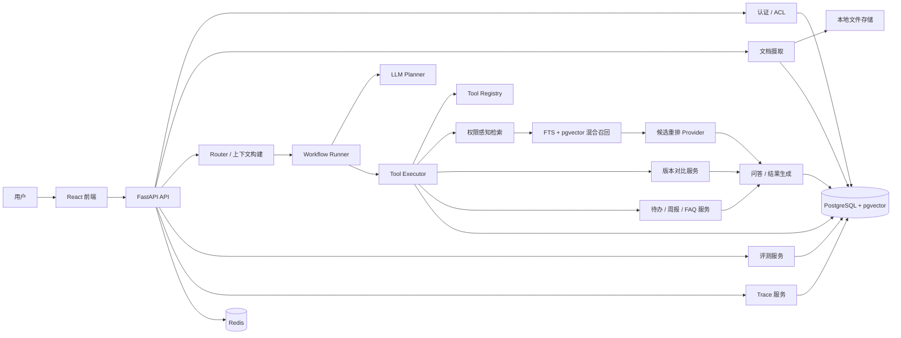

# 权限感知的 RAG 企业文档知识助手

面向企业知识库的权限感知 RAG 应用，支持多角色与多级部门访问控制、引用溯源、版本对比、多步骤处理与结构化结果生成。

## 界面预览
<p align="center">
  
</p>
<p align="center">
  
</p>
<p align="center">
  <sub>引用问答与证据溯源 / 多级部门与用户管理</sub>
</p>

## 项目概述
项目面向企业知识库场景，聚焦权限控制、文档检索、引用溯源、版本追踪和结构化结果生成。当前实现已将文档摄取、权限感知检索、引用问答和结果沉淀整合到同一条链路中。

系统主要解决以下问题：
- 用户只能检索和引用自己有权限访问的文档
- 回答应尽量附带 citation，方便核对依据
- 会话不止用于问答，还能继续沉淀为待办、周报草稿和 FAQ 草稿
- 文档版本变更可以被对比、总结和解释
- 复合请求可以基于当前证据决定下一步工具
- 整个链路可以被评测和追踪，便于回归和排查

## 能力范围
当前版本包括以下能力：
- 权限感知检索：无权限文档不会进入候选集
- 候选重排：混合召回后的安全候选会进入 rerank 阶段，默认使用本地 heuristic，也可配置 LLM 或 Qwen rerank provider
- 引用式问答：回答与引用来源分开返回
- 事实级证据审计：展示答案关键事实、支撑状态和对应证据片段
- 多步骤处理与轨迹回看：前端可展开查看每一步处理过程和最终结果
- 轻量上下文复用：保留最近多轮消息，并复用上一轮目标文档、工具、结果类型与 observation 摘要
- 版本对比：支持原始 diff、差异摘要和影响提示
- 结构化结果生成：支持待办、周报草稿、FAQ 草稿生成
- 长任务恢复：chat、eval、文档入库和 diff 摘要支持后台 job 与刷新 / 切页后恢复
- 评测与链路追踪：支持效果验证、阶段耗时、pipeline diagnosis 与 trace 记录
- 权限审计：支持查看用户可见范围、ACL 影响分析和疑似越权检索审计
- 用户与部门管理：支持管理员维护用户、分配角色、调整启停状态，并通过树状视图管理多级部门

## 主要功能
- 支持登录、管理员创建用户、维护角色、启停状态和所属部门
- 当前已接入 `TXT / Markdown / HTML / PDF / DOCX / CSV / PNG / JPG / JPEG` 的上传与解析链路
- 当前对 Markdown、HTML、DOCX、CSV 和文本型 PDF 提供基础表格提取，表格行会转成可检索文本
- 当前可选图片 OCR 入库；扫描版 PDF 仅在页级文本不足时走 OCR fallback，规整图片表格只做 best-effort 提取
- 保留文档版本和基础历史记录
- 文档级 ACL 当前覆盖 `public / user / role / department`，部门 ACL 支持父子部门继承，并兼容旧版 `team_name` 数据
- 部门管理支持树状展示、新建、改名、移动、删除保护和稳定组织编号
- 基于 PostgreSQL FTS + pgvector 的权限感知混合检索，外加可配置候选重排
- 引用式问答返回 answer / citation / confidence，并在证据不足时显式兜底
- 基于上下文的多步骤处理在已注册工具集合内完成有限步决策
- 当前派生工作流包括：
  - 待办提取
  - 周报草稿生成
  - FAQ 草稿沉淀
- 文档 diff 当前提供 unified diff、变更摘要和影响提示
- chat、eval、文档入库和 diff 摘要支持异步 job，按任务类型拆分 ARQ 队列
- 当前评测指标包括：
  - retrieval hit rate
  - citation accuracy
  - answer faithfulness
  - permission isolation correctness
- 链路记录当前保留 trace、召回 chunk、selected citation、阶段耗时、pipeline diagnosis、token 和错误信息
- 提供一套 React 前端用于串联文档、问答、版本、评测与追踪页面

## 设计重点
- 权限过滤在检索阶段生效，候选集、citation 和 prompt 都只基于可访问文档
- 检索链路采用 `ACL -> hybrid retrieval -> rerank provider -> grounded answer`
- 回答与 citation 分开返回，前端可以单独展示来源片段和定位信息
- 系统会先判断问题类型，再结合当前上下文和已有结果决定下一步处理
- 多步骤处理按 `observe -> decide -> act` 方式执行，最多执行 3 步，并限制在白名单工具内
- 多轮追问可复用上一轮目标文档、上一轮工具、结果类型和 observation 摘要，但不引入长期 memory 或额外状态表
- 会话结果可以继续派生成待办、周报草稿和 FAQ 草稿
- 版本对比同时保留原始 diff、摘要和影响提示
- 长任务状态通过 operation job 记录，前端可在刷新或切页后恢复 queued / running / completed / failed 状态
- 评测与 trace 数据落库，便于复现问题、回看链路和定位失败阶段

## 系统架构


## 仓库结构
```text
/backend
  /alembic
  /app
    /api
    /core
    /db
    /models
    /repositories
    /schemas
    /services
    /tests
    /workers
/frontend
  /src
/docs
/scripts
docker-compose.yml
```

## 技术栈
- 后端：Python 3.11、FastAPI、Pydantic v2、SQLAlchemy 2.x、Alembic
- 数据库：PostgreSQL、pgvector
- 缓存：Redis
- 前端：React、Vite、TypeScript、React Router
- 模型接入：OpenAI SDK、兼容 OpenAI 协议的模型服务、deterministic fallback
- 文档解析：pdfplumber、pypdf、python-docx、BeautifulSoup、PyMuPDF、Pillow、pytesseract / Tesseract
- 测试：pytest
- 本地运行与集成：Docker Compose

## 已实现模块
- 认证、用户管理和本地演示数据初始化
- 角色、多级部门、文档 ACL、权限判断与访问诊断
- 文档上传、解析、切块、向量化、索引
- 权限感知混合检索与可配置候选重排
- citation grounding 问答与会话历史
- 基于上下文的多步骤处理、处理轨迹与轻量上下文复用
- 待办提取 / 周报草稿 / FAQ 草稿
- 文档版本上传、版本对比与摘要
- 后台 job 与按类型拆分的 ARQ worker
- Eval 服务、固定评测报告、benchmark 分层、权限隔离回归和前端评测控制台
- Observability trace 与简单 dashboard API
- 权限审计接口、ACL 影响分析和用户可见范围查看
- React 前端整合页面

## 当前未实现
- 企业级 SSO / LDAP / OAuth 接入
- 多租户隔离与跨组织策略管理
- 跨队列任务的更完整监控、重试策略、告警和运维治理
- 低清扫描、旋转拍照、复杂合并单元格、复杂跨页表格和图片型复杂版面的稳定结构化
- 复杂 Excel、多 sheet XLSX 和合并单元格表格解析
- Slack / 飞书 / 邮件等外部协作集成
- 外部裁判模型评测、人工标注闭环和自动化报告看板
- 完整的生产部署与安全加固

## 运行与验证
- 支持通过 `docker compose up --build` 拉起 PostgreSQL、Redis、FastAPI 和 React 本地环境
- 提供 `seed_demo_data.py` 用于初始化演示知识库、版本和权限数据
- 仓库包含 chat、search、ACL、version、结构化结果、eval、observability 等后端测试用例
- 已覆盖管理员用户维护、角色权限、部门 ACL、文档 ACL 和权限隔离回归验证
- 当前后端测试已覆盖多工具串联、版本对比后停止、未知工具拒绝、`max_steps` 生效、无权限追问拒答与证据不足阻断结构化生成等场景
- 检索调试信息会记录 `pre_rerank_count / post_rerank_count / rerank_strategy`、阶段耗时和 skip reason，便于回看召回后重排阶段
- 当前中文企业文档 RAG 证据包见 [`docs/ZH_ENTERPRISE_RAG_BENCHMARK_EVIDENCE_PACK.md`](docs/ZH_ENTERPRISE_RAG_BENCHMARK_EVIDENCE_PACK.md)，指标摘要见 [`docs/RAG_BENCHMARK_METRICS_SUMMARY.md`](docs/RAG_BENCHMARK_METRICS_SUMMARY.md)。导入脚本支持本地 manifest、FinanceBench、BEIR、ConcurrentQA 和格式覆盖入口；Insights 页面支持选择评测集、运行 Top-K 评测、查看历史趋势和失败原因分布。

## 候选重排 Provider
检索链路保持 `ACL -> hybrid retrieval -> rerank -> grounded answer`。默认使用本地 heuristic rerank，不依赖外部服务；也可以通过环境变量显式切换到 LLM rerank 或 Qwen rerank provider 做实验。

```env
RERANK_PROVIDER=heuristic
```

## OCR 与图片表格说明
- OCR 通过 `ENABLE_OCR` 开关启用，主要用于扫描 PDF、图片文件和文档中的内嵌图片。
- PDF 优先解析可复制文本；只有页级文本不足时才走 OCR fallback，避免重复识别。
- 图片表格主要覆盖规整表格的 best-effort 提取。低清扫描、旋转拍照、复杂合并单元格、跨页表格和流程图 / 组织图等复杂图片属于能力边界。

## 多步骤处理说明
系统在现有 RAG 链路上补充了一层多步骤处理流程，用于串起检索、版本对比和结构化结果生成等请求：

- 系统会先判断问题属于文档问答、主题问答、版本对比还是结构化结果生成
- 对于需要分步完成的请求，系统会结合当前问题、会话上下文和已有结果决定下一步处理
- 允许工具固定为 `search_docs / compare_versions / extract_todos / generate_weekly_report / generate_faq`
- 整个流程最多执行 3 步，超过上限后会基于已有结果收束为最终回答、拒答或补充说明
- 当前处理结果会保留每一步的工具选择、执行结果和最终处理状态，并限制在白名单工具内
- assistant 消息 metadata 与 trace 中会保留当前处理轨迹，便于前端展示和问题排查
- 前端“处理轨迹”面板主视图展示当前处理步骤，旧五步摘要折叠为“兼容摘要”

典型链路示例：
- 文档问答：`search_docs -> final_answer`
- 检索后提取待办：`search_docs -> extract_todos -> final_answer`
- 版本对比后整理事项：`compare_versions -> extract_todos -> final_answer`
- 上下文不足时生成周报：会直接拒绝，不强行继续生成

这套处理流程的重点是让系统在已有证据和上下文基础上分步完成请求，同时保留可回看的处理轨迹。

## 评测结果

### 中文企业文档固定评测集（`zh_enterprise_v1_seed`，102 docs / 234 cases）

当前主评测使用固定 manifest：

```text
backend/data/benchmark_raw/zh_enterprise/v1_case_manifest_strict_evidence_verified.json
```

端到端产品指标基于 routing、检索、引用选择、答案生成和 claim-level faithfulness 评分：

| 指标 | 当前值 |
|------|------:|
| retrieval_hit_rate_avg | 0.9229 |
| citation_accuracy_avg | 0.8518 |
| answer_faithfulness_avg | 0.8986 |
| permission_isolation_pass_rate | 1.0000 |
| overall_score_avg | 0.9183 |
| pass_rate | 215 / 234 = 0.9188 |

同一固定集的 retrieval-only 结果为 `Recall@10 = 1.0000`、`Evidence Recall@10 = 0.9979`、`Permission = 1.0000`。这组结果衡量证据进入 top-k 的情况；端到端产品指标还包含最终引用选择和答案生成。

四个主指标含义：

- `retrieval_hit_rate_avg`：看目标文档是否被召回；回答型结合 recall / precision / nDCG / fact recall，拒答型看越权召回率
- `citation_accuracy_avg`：看引用是否落在预期证据上；回答型结合 citation F1 和 evidence fact recall，拒答型看越权引用率
- `answer_faithfulness_avg`：抽取答案里实际说出的 claim，再看这些 claim 是否被最终选中的引用证据支撑
- `permission_isolation_pass_rate`：看受限内容是否在检索、引用或答案里泄漏


## 本地启动
### Docker Compose
在仓库根目录执行：

```powershell
docker compose up --build
```

启动后默认服务：
- PostgreSQL + pgvector：`localhost:5432`
- Redis：容器内服务，backend 通过 `redis:6379` 访问
- FastAPI 后端：`http://localhost:9500`
- React 前端：`http://localhost:18073`

如需覆盖默认前端端口，可在仓库根目录 `.env` 中设置 `FRONTEND_PORT=xxxxx`，并确保该端口未被占用、也不在 Windows 的保留端口范围内。

### 初始化演示数据
容器启动后执行：

```powershell
docker compose exec backend python /app/scripts/seed_demo_data.py
```

会初始化一组适合演示的中文知识库数据，包括：
- `员工手册`
- `平台发布手册`
- `客户事故响应指南`
- `安全例外登记`

### 不使用 Docker 的本地开发方式
后端：

```powershell
cd backend
python -m venv .venv
.\.venv\Scripts\Activate.ps1
Copy-Item .env.example .env
pip install -e .
alembic upgrade head
uvicorn app.main:app --reload
```

前端：

```powershell
cd frontend
npm install
npm run dev
```

## 演示流程
1. 执行 `docker compose up --build`
2. 执行 `docker compose exec backend python /app/scripts/seed_demo_data.py`
3. 打开 `http://localhost:18073`
4. 使用登录页提供的管理员演示账号进入系统，或在 `Users` 页面创建需要的本地测试账号
5. 在 `Documents` 页面查看文档、版本、ACL 和 chunk
6. 在 `Users` 页面维护用户、角色、启停状态和所属部门
7. 在 `Documents` 页面配置 ACL，验证不同用户的可访问范围
8. 在 `Chat` 页面提问并查看 citation
9. 从当前 session 生成待办、周报草稿和 FAQ 草稿
10. 在 `Versions` 页面查看文档 diff 和摘要
11. 在 `Insights` 页面运行 eval 并查看 trace

## 关键接口
### 认证
- `POST /api/v1/auth/login`
- `GET /api/v1/auth/me`

### 文档与权限
- `POST /api/v1/documents/upload`
- `GET /api/v1/documents`
- `GET /api/v1/documents/{id}`
- `POST /api/v1/documents/{id}/versions/upload`
- `GET /api/v1/documents/{id}/versions`
- `GET /api/v1/documents/{id}/versions/{version_id}`
- `POST /api/v1/documents/{id}/acl`
- `GET /api/v1/documents/{id}/acl`
- `GET /api/v1/documents/{id}/access-debug`
- `POST /api/v1/documents/{id}/ingest`
- `POST /api/v1/documents/{id}/ingest/async`
- `GET /api/v1/documents/{id}/chunks`
- `GET /api/v1/permissions/users/{user_id}/scope`
- `POST /api/v1/permissions/documents/{document_id}/acl/impact`
- `GET /api/v1/permissions/audit/traces`

### 用户与部门
- `GET /api/v1/users`
- `POST /api/v1/users`
- `PATCH /api/v1/users/{id}`
- `DELETE /api/v1/users/{id}`
- `GET /api/v1/departments`
- `POST /api/v1/departments`
- `PATCH /api/v1/departments/{id}`
- `DELETE /api/v1/departments/{id}`

### 检索与问答
- `POST /api/v1/search`
- `POST /api/v1/chat/sessions`
- `GET /api/v1/chat/sessions`
- `GET /api/v1/chat/sessions/{id}`
- `POST /api/v1/chat/sessions/{id}/messages`
- `POST /api/v1/chat/sessions/{id}/messages/async`

### 后台任务
- `GET /api/v1/jobs/{job_id}`

### 任务流转
- `POST /api/v1/tasks/extract`
- `GET /api/v1/tasks`
- `POST /api/v1/reports/weekly`
- `GET /api/v1/reports`
- `POST /api/v1/faqs/generate`
- `GET /api/v1/faqs`

### 版本差异
- `GET /api/v1/documents/{id}/diff?from_version=&to_version=`
- `POST /api/v1/documents/{id}/diff/summary`
- `POST /api/v1/documents/{id}/diff/summary/async`

### Eval 与 Observability
- `POST /api/v1/eval/run`
- `POST /api/v1/eval/run/async`
- `GET /api/v1/eval/runs`
- `GET /api/v1/eval/runs/{id}`
- `GET /api/v1/observability/traces`
- `GET /api/v1/observability/traces/{id}`

## 环境变量说明
- Docker Compose 下前端通过 Vite 代理 `/api` 到容器内的 `http://backend:8000`
- 宿主机访问后端地址为 `http://localhost:9500`
- 是否依赖外部模型取决于 `backend/.env` 配置；当前仓库保留 deterministic 回退能力，外部调用失败时本地链路仍可继续运行
- `JWT_SECRET_KEY` 建议使用至少 32 字节以上的随机字符串；仓库中的示例值仅用于本地开发与演示

### 模型与 Embedding 配置
当前后端同时支持两类模型配置：一类用于问答、路由和版本摘要，另一类用于 embedding。当前仓库推荐的联调组合为“DeepSeek 负责 chat，OpenRouter 负责 embedding”：

```env
EMBEDDING_PROVIDER=openai
ANSWER_PROVIDER=openai_compatible
ROUTER_PROVIDER=openai_compatible
DIFF_SUMMARY_PROVIDER=openai_compatible

LLM_API_KEY=your_deepseek_api_key
LLM_BASE_URL=https://api.deepseek.com
LLM_CHAT_MODEL=deepseek-v4-flash
LLM_ROUTER_MODEL=deepseek-v4-flash
LLM_REASONING_MODEL=deepseek-v4-pro

OPENAI_API_KEY=your_openrouter_api_key
OPENAI_BASE_URL=https://openrouter.ai/api/v1
OPENAI_EMBEDDING_MODEL=openai/text-embedding-3-small
OPENAI_CHAT_MODEL=gpt-4.1-mini
OPENAI_ROUTER_MODEL=gpt-4.1-mini
OPENAI_DIFF_MODEL=gpt-4.1-mini

JWT_SECRET_KEY=replace-with-a-long-random-secret
```

配置说明：
- `LLM_BASE_URL` 用于接入 DeepSeek 等 OpenAI-compatible 聊天模型服务
- `LLM_CHAT_MODEL / LLM_ROUTER_MODEL / LLM_REASONING_MODEL` 对应问答、路由与推理模型配置
- `OPENAI_BASE_URL` 可用于把 embedding 请求映射到 OpenRouter 等兼容 OpenAI embeddings 的服务
- `OPENAI_API_KEY` 在这套组合里填写 OpenRouter key
- 当前仓库已验证可通过 OpenRouter 的 embeddings 接口生成 1536 维向量
- 若 embedding 请求失败，系统会自动回退到 deterministic embedding，让本地摄取和演示链路仍可继续运行

## 文档说明
- 项目概览：[`docs/PROJECT_OVERVIEW.md`](docs/PROJECT_OVERVIEW.md)
- 当前指标摘要：[`docs/RAG_BENCHMARK_METRICS_SUMMARY.md`](docs/RAG_BENCHMARK_METRICS_SUMMARY.md)
- 中文企业文档评测证据包：[`docs/ZH_ENTERPRISE_RAG_BENCHMARK_EVIDENCE_PACK.md`](docs/ZH_ENTERPRISE_RAG_BENCHMARK_EVIDENCE_PACK.md)
- RAG 技术链路：[`docs/RAG_NOTES.md`](docs/RAG_NOTES.md)


