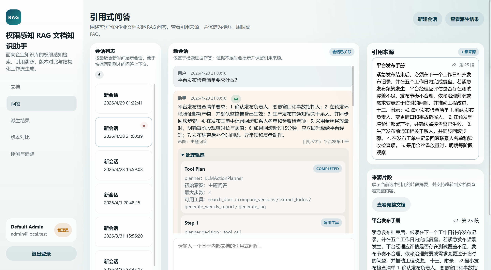
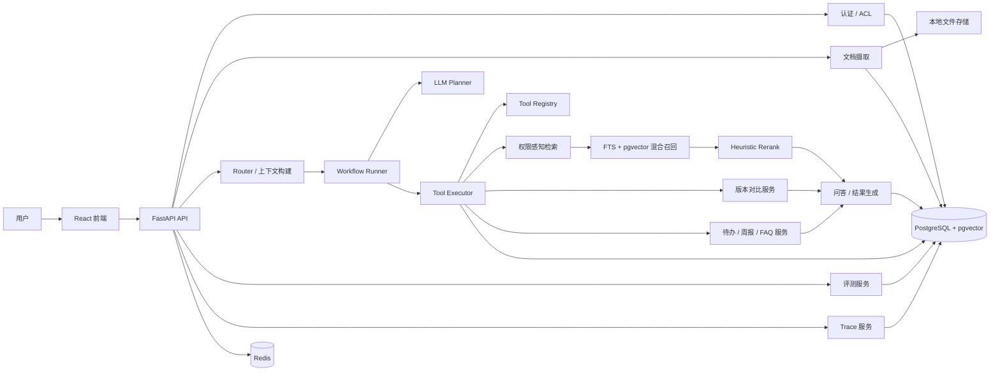

# 权限感知的 RAG 企业文档知识助手

面向企业知识库的权限感知 RAG 应用，支持多角色访问控制、引用溯源、版本对比、多步骤处理与结构化结果生成。

## 界面预览
<p align="center">
  
</p>
<p align="center">
  <sub>主流程示意：权限感知检索、引用问答与会话沉淀</sub>
</p>

## 项目概述
项目面向企业知识库场景，聚焦权限控制、文档检索、引用溯源、版本追踪和结构化结果生成。当前实现已将文档摄取、权限感知检索、引用问答和结果沉淀整合到同一条链路中。

系统主要解决以下问题：
- 用户只能检索和引用自己有权限访问的文档
- 回答应尽量附带 citation，方便核对依据
- 会话不止用于问答，还能继续沉淀为待办、周报草稿和 FAQ 草稿
- 文档版本变更可以被对比、总结和解释
- 复合请求不应只走固定分支，而要能基于当前证据决定下一步工具
- 整个链路可以被评测和追踪，便于回归和排查

## 能力范围
当前版本包括以下能力：
- 权限感知检索：无权限文档不会进入候选集
- 候选重排：混合召回后的安全候选会进入轻量 rerank 阶段，再选出最终 `top_k`
- 引用式问答：回答与引用来源分开返回
- 多步骤处理与轨迹回看：前端可展开查看每一步处理过程和最终结果
- 轻量上下文复用：保留最近多轮消息，并复用上一轮目标文档、工具、结果类型与 observation 摘要
- 版本对比：支持原始 diff、差异摘要和影响提示
- 结构化结果生成：支持待办、周报草稿、FAQ 草稿生成
- 评测与链路追踪：支持效果验证与 trace 记录

## 主要功能
- 内置演示账号覆盖 `viewer / manager / admin` 三类角色，并额外提供 `viewer2@local.test` 用于团队权限演示
- 支持 `TXT / Markdown / HTML / PDF / DOCX / CSV` 文档上传与摄取
- 支持 Markdown、HTML、DOCX、CSV 和文本型 PDF 表格提取，表格行会转成可检索文本
- 文档版本管理与历史保留
- 文档级 ACL：支持 `public / user / role / team`
- 基于 PostgreSQL FTS + pgvector 的权限感知混合检索与候选重排
- 引用式问答：回答、citation、confidence、证据不足兜底
- 基于上下文的多步骤处理：系统会结合问题、会话内容和已有结果决定下一步处理
- 派生工作流：
  - 待办提取
  - 周报草稿生成
  - FAQ 草稿沉淀
- 文档 diff：原始 unified diff、变更摘要、潜在影响提示
- Eval：
  - retrieval hit rate
  - citation accuracy
  - answer faithfulness
  - permission isolation correctness
- Observability：记录 trace、召回 chunk、selected citation、延迟、token、错误
- 用于展示完整业务链路的 React 前端

## 设计重点
- 权限过滤在检索阶段生效，候选集、citation 和 prompt 都只基于可访问文档
- 检索链路采用 `ACL -> hybrid retrieval -> heuristic rerank -> grounded answer`
- 回答与 citation 分开返回，前端可以单独展示来源片段和定位信息
- 系统会先判断问题类型，再结合当前上下文和已有结果决定下一步处理
- 多步骤处理按 `observe -> decide -> act` 方式执行，最多执行 3 步，未知工具不会被执行
- 多轮追问可复用上一轮目标文档、上一轮工具、结果类型和 observation 摘要，但不引入长期 memory 或额外状态表
- 会话结果可以继续派生成待办、周报草稿和 FAQ 草稿
- 版本对比同时保留原始 diff、摘要和影响提示
- 评测与 trace 数据落库，便于复现问题和回看链路

## 系统架构


## 仓库结构
```text
/backend
  /alembic
  /app
    /api
    /core
    /db
    /models
    /repositories
    /schemas
    /services
    /tests
    /workers
/frontend
  /src
/docs
/scripts
docker-compose.yml
```

## 技术栈
- 后端：Python 3.11、FastAPI、Pydantic v2、SQLAlchemy 2.x、Alembic
- 数据库：PostgreSQL、pgvector
- 缓存：Redis
- 前端：React、Vite、TypeScript、React Router
- 模型接入：OpenAI SDK、兼容 OpenAI 协议的模型服务、deterministic fallback
- 测试：pytest
- 本地运行与集成：Docker Compose

## 已实现模块
- 认证与 mock 用户初始化
- 角色、文档 ACL、权限判断
- 文档上传、解析、切块、向量化、索引
- 权限感知混合检索与候选重排
- citation grounding 问答与会话历史
- 基于上下文的多步骤处理、处理轨迹与轻量上下文复用
- 待办提取 / 周报草稿 / FAQ 草稿
- 文档版本上传、版本对比与摘要
- Eval 服务与 demo case
- Observability trace 与简单 dashboard API
- 最小前端整合页面

## 当前未实现
- 企业级 SSO / LDAP / OAuth 接入
- 多租户与复杂组织架构
- 生产级异步任务队列
- 扫描版 PDF、图片型表格和复杂 PDF 表格的 OCR / 结构恢复
- 复杂 Excel、多 sheet XLSX 和合并单元格表格解析
- Slack / 飞书 / 邮件等外部协作集成
- cross-encoder rerank 或更高级 judge 评测
- 完整的生产部署与安全加固

## 运行与验证
- 支持通过 `docker compose up --build` 拉起 PostgreSQL、Redis、FastAPI 和 React 本地环境
- 提供 `seed_demo_data.py` 用于初始化演示知识库、版本和权限数据
- 仓库包含 chat、search、ACL、version、结构化结果、eval、observability 等后端测试用例
- 已覆盖 `admin / manager / viewer` 三类角色的演示与回归验证，并补充 `viewer2` 作为团队权限演示账号
- 当前后端测试已覆盖多工具串联、版本对比后停止、未知工具拒绝、`max_steps` 生效、无权限追问拒答与证据不足阻断结构化生成等场景
- 检索结果 debug 现已记录 `pre_rerank_count / post_rerank_count / rerank_strategy`，便于回看召回后重排阶段

## 多步骤处理说明
系统在现有 RAG 链路上补充了一层多步骤处理流程，用于串起检索、版本对比和结构化结果生成等请求：

- 系统会先判断问题属于文档问答、主题问答、版本对比还是结构化结果生成
- 对于需要分步完成的请求，系统会结合当前问题、会话上下文和已有结果决定下一步处理
- 允许工具固定为 `search_docs / compare_versions / extract_todos / generate_weekly_report / generate_faq`
- 整个流程最多执行 3 步，超过上限后会基于已有结果收束为最终回答、拒答或补充说明
- 当前处理结果会保留每一步的工具选择、执行结果和最终处理状态，未知工具不会被执行
- assistant 消息 metadata 与 trace 中会保留当前处理轨迹，便于前端展示和问题排查
- 前端“处理轨迹”面板主视图展示当前处理步骤，旧五步摘要折叠为“兼容摘要”

典型链路示例：
- 文档问答：`search_docs -> final_answer`
- 检索后提取待办：`search_docs -> extract_todos -> final_answer`
- 版本对比后整理事项：`compare_versions -> extract_todos -> final_answer`
- 上下文不足时生成周报：会直接拒绝，不强行继续生成

这套处理流程的重点是让系统在已有证据和上下文基础上分步完成请求，同时保留可回看的处理轨迹。

## 评测结果

### 回归修复集（`demo_permission_eval`，3 cases）

| 指标 | 修复前 | 修复后 |
|------|--------|--------|
| retrieval_hit_rate_avg | 0.667 | 1.0 |
| citation_accuracy_avg | 0.667 | 1.0 |
| answer_faithfulness_avg | 0.60 | 0.933 |
| permission_isolation_pass_rate | 0.667 | 1.0 |

在 `demo_permission_eval` 中，`viewer` 账号的 `team_name` 与评测用例预期不一致，导致权限隔离用例失败。修正默认用户同步逻辑并补充回归测试后，这组 3 条用例已恢复通过。

### 扩展权限矩阵集（`demo_access_matrix_eval`，8 cases）

| 指标 | 当前结果 |
|------|----------|
| pass_count | 8 / 8 |
| retrieval_hit_rate_avg | 1.0 |
| citation_accuracy_avg | 1.0 |
| answer_faithfulness_avg | 0.95 |
| permission_isolation_pass_rate | 1.0 |

这组扩展评测覆盖公开文档、团队 ACL 文档、角色 ACL 文档和管理员专属文档场景，主要验证不同权限条件下的可访问、不可访问与拒答行为。


## 本地启动
### Docker Compose
在仓库根目录执行：

```powershell
docker compose up --build
```

启动后默认服务：
- PostgreSQL + pgvector：`localhost:5432`
- Redis：`localhost:6379`
- FastAPI 后端：`http://localhost:8500`
- React 前端：`http://localhost:5173`

### 初始化演示数据
容器启动后执行：

```powershell
docker compose exec backend python /app/scripts/seed_demo_data.py
```

会初始化一组适合演示的中文知识库数据，包括：
- `员工手册`
- `平台发布手册`
- `客户事故响应指南`
- `安全例外登记`

### 不使用 Docker 的本地开发方式
后端：

```powershell
cd backend
python -m venv .venv
.\.venv\Scripts\Activate.ps1
Copy-Item .env.example .env
pip install -e .
alembic upgrade head
uvicorn app.main:app --reload
```

前端：

```powershell
cd frontend
npm install
npm run dev
```

## 演示账号
当后端环境变量 `SEED_MOCK_DATA=true` 时，系统启动会自动创建以下账号：
- `viewer@local.test / viewer123`
- `viewer2@local.test / viewer123`
- `manager@local.test / manager123`
- `admin@local.test / admin123`

其中 `viewer2@local.test` 为手动演示账号，角色仍为 `viewer`，但所属团队为 `platform`，可用于单独演示 team ACL 文档访问场景。

## 演示流程
1. 执行 `docker compose up --build`
2. 执行 `docker compose exec backend python /app/scripts/seed_demo_data.py`
3. 打开 `http://localhost:5173`
4. 使用 `admin@local.test` 登录
5. 在 `Documents` 页面查看文档、版本、ACL 和 chunk
6. 在 `Chat` 页面提问并查看 citation
7. 从当前 session 生成待办、周报草稿和 FAQ 草稿
8. 在 `Versions` 页面查看文档 diff 和摘要
9. 在 `Insights` 页面运行 demo eval 并查看 trace
10. 如需演示团队权限，可手动输入 `viewer2@local.test / viewer123` 并验证团队文档访问效果

## 关键接口
### 认证
- `POST /api/v1/auth/login`
- `GET /api/v1/auth/me`

### 文档与权限
- `POST /api/v1/documents/upload`
- `GET /api/v1/documents`
- `GET /api/v1/documents/{id}`
- `POST /api/v1/documents/{id}/versions/upload`
- `GET /api/v1/documents/{id}/versions`
- `GET /api/v1/documents/{id}/versions/{version_id}`
- `POST /api/v1/documents/{id}/acl`
- `GET /api/v1/documents/{id}/acl`
- `POST /api/v1/documents/{id}/ingest`
- `GET /api/v1/documents/{id}/chunks`

### 检索与问答
- `POST /api/v1/search`
- `POST /api/v1/chat/sessions`
- `GET /api/v1/chat/sessions`
- `GET /api/v1/chat/sessions/{id}`
- `POST /api/v1/chat/sessions/{id}/messages`

### 任务流转
- `POST /api/v1/tasks/extract`
- `GET /api/v1/tasks`
- `POST /api/v1/reports/weekly`
- `GET /api/v1/reports`
- `POST /api/v1/faqs/generate`
- `GET /api/v1/faqs`

### 版本差异
- `GET /api/v1/documents/{id}/diff?from_version=&to_version=`
- `POST /api/v1/documents/{id}/diff/summary`

### Eval 与 Observability
- `POST /api/v1/eval/run`
- `GET /api/v1/eval/runs`
- `GET /api/v1/eval/runs/{id}`
- `GET /api/v1/observability/traces`
- `GET /api/v1/observability/traces/{id}`

## 环境变量说明
- Docker Compose 下前端通过 Vite 代理 `/api` 到容器内的 `http://backend:8000`
- 宿主机访问后端地址为 `http://localhost:8500`
- 是否依赖外部模型取决于 `backend/.env` 配置；当前仓库保留 deterministic 回退能力，外部调用失败时本地链路仍可继续运行
- `JWT_SECRET_KEY` 建议使用至少 32 字节以上的随机字符串；仓库中的示例值仅用于本地开发与演示

### 模型与 Embedding 配置
当前后端同时支持两类模型配置：一类用于问答、路由和版本摘要，另一类用于 embedding。当前仓库推荐的联调组合为“DeepSeek 负责 chat，OpenRouter 负责 embedding”：

```env
EMBEDDING_PROVIDER=openai
ANSWER_PROVIDER=openai_compatible
ROUTER_PROVIDER=openai_compatible
DIFF_SUMMARY_PROVIDER=openai_compatible

LLM_API_KEY=your_deepseek_api_key
LLM_BASE_URL=https://api.deepseek.com
LLM_CHAT_MODEL=deepseek-chat
LLM_ROUTER_MODEL=deepseek-chat
LLM_REASONING_MODEL=deepseek-reasoner

OPENAI_API_KEY=your_openrouter_api_key
OPENAI_BASE_URL=https://openrouter.ai/api/v1
OPENAI_EMBEDDING_MODEL=openai/text-embedding-3-small
OPENAI_CHAT_MODEL=gpt-4.1-mini
OPENAI_ROUTER_MODEL=gpt-4.1-mini
OPENAI_DIFF_MODEL=gpt-4.1-mini

JWT_SECRET_KEY=replace-with-a-long-random-secret
```

配置说明：
- `LLM_BASE_URL` 用于接入 DeepSeek 等 OpenAI-compatible 聊天模型服务
- `LLM_CHAT_MODEL / LLM_ROUTER_MODEL / LLM_REASONING_MODEL` 对应问答、路由与推理模型配置
- `OPENAI_BASE_URL` 可用于把 embedding 请求映射到 OpenRouter 等兼容 OpenAI embeddings 的服务
- `OPENAI_API_KEY` 在这套组合里应填写 OpenRouter key，而不是 OpenAI 官方 key
- 当前仓库已验证可通过 OpenRouter 的 embeddings 接口生成 1536 维向量
- 若 embedding 请求失败，系统会自动回退到 deterministic embedding，保证摄取和演示链路不中断

## 文档说明
- RAG 技术链路：[`docs/RAG_NOTES.md`](docs/RAG_NOTES.md)
- 项目概览：[`docs/PROJECT_OVERVIEW.md`](docs/PROJECT_OVERVIEW.md)
- 手动上传演示样例：[`docs/manual_upload_demo.md`](docs/manual_upload_demo.md)
- 手动上传演示样例 v2：[`docs/manual_upload_demo_v2.md`](docs/manual_upload_demo_v2.md)


