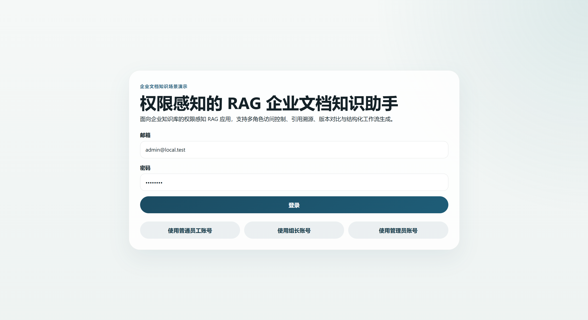
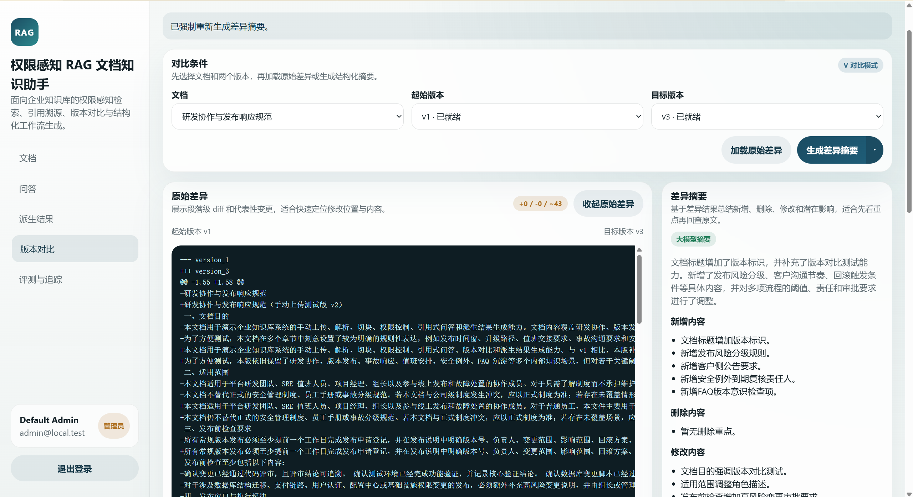

# 权限感知的 RAG 企业文档知识助手：项目概览

## 项目一句话
面向企业知识库的文档应用，重点支持权限感知检索、引用问答、版本对比、多步骤处理、结构化结果生成和基础评测追踪。

## 补充界面

  
  

  文档与权限管理 / 版本对比与结果生成

## 当前完成度
### 已实现
- mock 登录与三类角色：`viewer / manager / admin`
- 支持 `TXT / Markdown / HTML / PDF / DOCX / CSV / PNG / JPG / JPEG` 文档上传与摄取
- 支持 Markdown、HTML、DOCX、CSV 和文本型 PDF 表格提取
- 支持图片文件 OCR 入库、扫描版 PDF 页级 OCR fallback，以及规整图片表格的 best-effort 提取
- 本地文件存储与文档版本保留
- 文档级 ACL：支持 `public / user / role / team`
- 基于 PostgreSQL FTS + pgvector 的权限感知混合检索与候选重排
- 带 citation、confidence 和拒答策略的 grounded chat
- 会话与消息历史持久化
- 多步骤处理与轻量上下文复用
- 结构化结果：待办提取、周报草稿、FAQ 草稿
- 文档版本 diff：原始 diff、摘要、影响提示
- Eval 服务与权限隔离测试
- Trace 存储与简单 observability API
- 用于展示完整流程的 React 前端演示页面

### 暂未实现
- 企业级 SSO / LDAP / OAuth
- 多租户组织树与复杂权限继承
- 生产级异步任务队列与 worker 编排
- DOCX / HTML / Markdown 内嵌图片 OCR 暂未完整支持
- 低清扫描、旋转拍照、复杂合并单元格、复杂跨页表格和图片型复杂版面的稳定结构化
- 复杂 Excel、多 sheet XLSX 和合并单元格表格解析
- Slack / 飞书等外部协作集成
- cross-encoder rerank 与更高级 faithfulness judge

## 主要解决的问题
- 用户只能检索和引用自己有权限访问的文档
- 回答不只给文本，还要尽量给出 citation
- 会话可以继续沉淀为待办、周报草稿和 FAQ 草稿
- 文档版本变化可以被对比、总结和解释
- 整个链路可以被评测和追踪，不只停留在手工演示

## 实现重点
- 权限过滤发生在检索阶段，候选集、citation 和 prompt 都只来自可访问文档
- 混合召回后的安全候选会进入轻量 rerank，再选出最终进入回答阶段的 chunk
- citation 作为结构化字段返回，前端可以单独展示来源片段和定位信息
- 问答作为入口，会话结果还可继续生成待办、周报草稿和 FAQ 草稿
- 当前版本既支持当前文档问答，也支持版本 diff 与变更摘要
- Eval 和 trace 会保留链路结果，便于排查问题和做回归验证
- 前端可直接展开查看处理轨迹，确认当前请求的工具选择与执行结果
- OCR 能力保持在 parser 层：图片和扫描页 OCR 结果仍进入 `ParsedSegment -> chunk -> embedding -> FTS / pgvector -> citation`，不新增数据库表，也不改变权限判断。
- 图片 OCR 会先做轻量降噪：低信息量标签、页码、图号之类的短文本会尽量被过滤，避免污染检索。
- 图片表格只覆盖规整表格的 best-effort 提取，并增加列对齐校验，尽量避免把图例、流程节点或散点标签误判成表格。
- 图表、流程图、组织图和示意图当前只提取可见文字，不提供图像语义理解；低清、旋转、复杂合并单元格和跨页图片表格不保证稳定恢复。

## 核心设计
### 权限感知检索
- 用户登录后先解析角色、team 和 ACL
- 后端先计算当前用户的可访问文档集合
- lexical retrieval 和 vector retrieval 只在这个集合内运行
- 无权限 chunk 不会进入候选集、citation 和 prompt

### 引用式问答
- 回答基于检索证据生成
- 返回 answer、citation、confidence
- 证据不足时会明确拒答，避免伪造结果

### 版本对比
- 支持两个版本之间的 raw diff
- 支持差异摘要与 impact hints
- 检索默认只查当前版本，避免历史版本污染问答

### 结构化结果生成
- 支持从问答会话提取待办
- 支持生成周报草稿
- 支持生成 FAQ 草稿

### 多步骤处理
- 系统会先判断请求类型，再结合问题、上下文和已有结果决定下一步处理
- 当前支持检索、版本对比、待办提取、周报草稿和 FAQ 草稿几类处理能力
- 整个流程最多执行 3 步，超过上限后会收束为最终回答、拒答或补充说明
- 多轮追问会复用上一轮目标文档、上一轮结果类型和会话摘要
- 这套处理流程适合文档问答、版本对比和结构化结果生成场景，也方便前端回看和回归验证

### 评测与追踪
- Eval 支持 retrieval、citation、faithfulness、permission isolation 等指标
- Trace 记录 query、retrieved chunks、selected citations、token、latency、error

## 适用场景
- 面向制度、流程、运维手册等企业内部文档的问答和检索
- 需要控制不同角色可见范围的知识库场景
- 需要保留引用来源、方便追溯回答依据的场景
- 需要把问答结果继续沉淀成待办、周报或 FAQ 的团队协作场景
- 需要查看文档版本变更和差异摘要的日常维护场景

## 后续可扩展方向
- 将当前轻量 rerank 升级为 cross-encoder 或模型重排序
- 接入 Langfuse / OpenTelemetry 做更完整的观测
- 将本地文件存储替换为 S3 / MinIO
- 增加 FAQ 审核流和结果回写
- 增加更完整的离线评测数据集和标注工具
